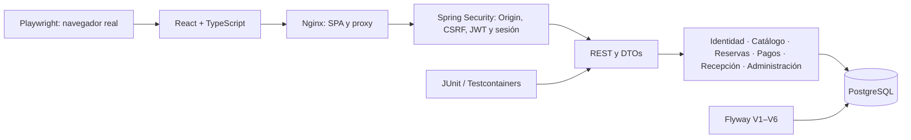
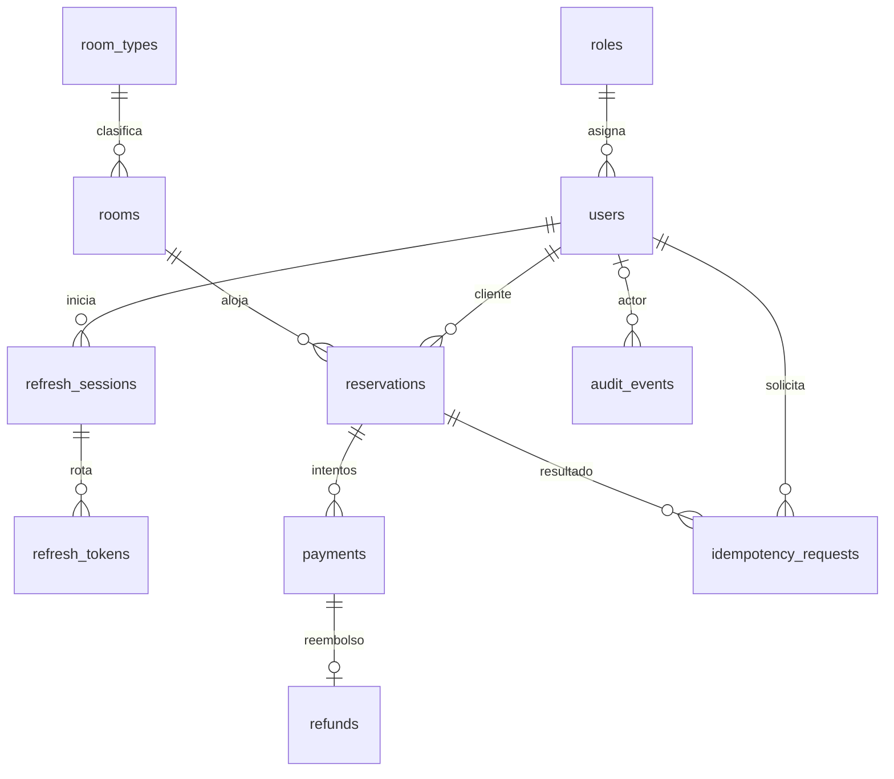

# Reservation Management System

Sistema Full Stack de reservas para un hotel: catálogo y disponibilidad pública, reservas, pagos simulados, recepción y administración. Proyecto de portafolio con API REST, seguridad en backend, transacciones PostgreSQL y pruebas de concurrencia real.

Fases 0–8 aprobadas en `6d93b6a`. Fase 9 — Presentación se entrega localmente para revisión, con demo aislada, Playwright y documentación de evaluación. Resultados: [docs/fase-9.md](docs/fase-9.md). Los informes históricos conservan el estado de sus respectivas entregas.

## Evaluación rápida con demo

Requisitos: Git, **Node.js 24.12.0**, Docker Desktop con motor Linux activo y Compose v2. Esta ruta no requiere Java, Maven ni PostgreSQL instalados. Reserva varios GB para imágenes y dependencias; con 4 GB asignados a Docker ejecuta las suites backend y aplicaciones por separado.

Desde PowerShell, Terminal o Bash:

```sh
git clone https://github.com/alonso123-star/reservation-management-system.git
cd reservation-management-system
node scripts/demo.mjs demo up
node scripts/demo.mjs demo seed
```

Los comandos de esta entrega estarán disponibles en GitHub después de aprobar y publicar Fase 9; mientras tanto se ejecutan sobre este working tree. La primera construcción puede tardar varios minutos. Abre [la demo](http://localhost:3001), usando **localhost**: Origin y cookies se verifican. Todos los puertos se publican solo en loopback.

| Rol | Correo sintético | Contraseña pública de demo |
|---|---|---|
| CLIENTE | `client@example.test` | `Demo-Only-Reservation-2026!` |
| EMPLEADO | `employee@example.test` | `Demo-Only-Reservation-2026!` |
| ADMIN | `admin@example.test` | `Demo-Only-Reservation-2026!` |

Estas cuentas existen únicamente después del seed en `rms-demo` o en fixtures `rms-e2e`. No son credenciales de producción. PostgreSQL y JWT usan secretos aleatorios guardados en `.env.demo`, ignorado por Git, sin imprimirse. El backend no carga cuentas demo automáticamente.

El seed crea Standard, Deluxe y Suite; ocho habitaciones en tres pisos, capacidades 2/3/4 y precios PEN 120/220/350. Seis están operativas, una en mantenimiento y otra fuera de servicio. Incluye cinco reservas: confirmada futura, huésped ingresado, estancia finalizada, cancelada con refund y no-show; seis intentos de pago, tres aprobados y un reembolso. Las operaciones generan auditoría mediante la API. Solo el primer ADMIN se promueve mediante SQL, antes de login y exclusivamente en la base aislada.

Recorrido sugerido:

1. Explora **Catálogo** y busca una estancia de dos noches para dos huéspedes dentro de un mes.
2. Como CLIENTE, revisa **Mis reservas**, pagos y refund. Crea otra reserva y prueba el simulador.
3. Como EMPLEADO, abre **Recepción** y el huésped ingresado. Para otro check-in, reserva desde hoy y completa el pago.
4. Como ADMIN, consulta usuarios, panel y auditoría. El panel requiere un periodo que incluya el día del seed; la fecha final queda excluida.

Las fechas siguen `America/Lima` al sembrar. No se altera el reloj del backend ni se actualizan fixtures al reiniciar. El seed rechaza una base con usuarios, conservando los datos; no duplica ni borra demostraciones existentes. Para renovar fechas o recuperar un seed interrumpido, reinicia explícitamente solo la demo:

```sh
node scripts/demo.mjs demo reset
node scripts/demo.mjs demo up
node scripts/demo.mjs demo seed
```

`reset` elimina los volúmenes del proyecto elegido. `stop` y `down` conservan datos.

## Funcionalidades y roles

| Capacidad | Público | CLIENTE | EMPLEADO | ADMIN |
|---|---|---|---|---|
| Catálogo y disponibilidad | Sí | Sí | Sí | Sí |
| Registro CLIENTE / login | Sí | Sí | Sí | Sí |
| Perfil, contraseña y sesiones propias | — | Sí | Sí | Sí |
| Reservas, historial, detalle y pagos | — | Propios | Hotel / para clientes | Hotel / para clientes |
| Cancelación | — | Propia antes del día de llegada | Antes de check-in | Antes de check-in |
| Inventario / estado operativo | — | — | Consulta / estado | Completo |
| Tipos y edición completa de habitaciones | — | — | — | Sí |
| Check-in, check-out y no-show | — | — | Sí | Sí |
| Usuarios, roles, estado, panel y auditoría | — | — | — | Sí |

Permisos y propiedad se verifican en backend. Ocultar botones no sustituye autorización. Búsqueda, filtros y paginación se resuelven en PostgreSQL.

## Stack, arquitectura y modelo de datos

| Componente | Tecnología |
|---|---|
| Backend | Java 21, Spring Boot 4.1.1, Spring Security, JPA, JDBC, Bean Validation |
| Datos | PostgreSQL 18.6, Flyway, NUMERIC, btree_gist |
| API | REST JSON, OpenAPI / springdoc 3.1.1, Problem Details |
| Frontend | React 19.2.8, TypeScript 5.9.3, Vite 8.2.2 |
| Formularios y estado | React Hook Form, Zod, TanStack Query, React Router |
| Pruebas | JUnit, Testcontainers, Vitest 5.0.0, Testing Library, Playwright 1.63.0 / Chromium |
| Entrega | Maven Wrapper 3.3.4 / Maven 3.9.16, npm lockfile, Docker Compose, Nginx, GitHub Actions |

Monolito modular. Los módulos agrupan API, aplicación, dominio e infraestructura según necesidad; sin microservicios ni colas externas.



```text
backend/
  src/main/java/com/portfolio/reservation/
    identity/ users/ rooms/ reservations/ payments/ reception/
    audit/ reporting/ shared/
  src/main/resources/db/migration/   # V1–V6 históricas
  src/test/java/                    # JUnit + PostgreSQL real
frontend/
  src/app/                         # Router, portada y navegación
  src/features/                    # UI por funcionalidad
  e2e/                             # Playwright y fixtures aislados
  playwright.config.ts
infrastructure/nginx/              # Proxy y fallback SPA
scripts/                           # Configuración, demo y smoke HTTP
docs/                              # Plan, ADR, contratos e informes
.github/workflows/ci.yml
compose.yaml
```

Modelo simplificado; existen además referencias de actor, autor y cancelador a `users`:



UUID generados por servidor; versiones para edición optimista; estancia DATE e instantes TIMESTAMPTZ. Reservas conservan tarifa, total y moneda históricos. Dinero BigDecimal / NUMERIC. Auditoría incluye metadatos y JSONB limitado a cambios de rol/estado; `auth_rate_limits` mantiene límites compartidos en PostgreSQL.

## Entorno propio sin demo

Base vacía, sin usuarios privilegiados predeterminados:

```sh
node scripts/setup-env.mjs
docker compose config --quiet
docker compose up --build --wait --wait-timeout 240
```

Se genera `.env` con secretos aleatorios y se conservan valores existentes. No lo imprimas ni lo subas. Registra una cuenta en la UI. Para aprovisionar expresamente el primer ADMIN local: `node scripts/bootstrap-admin.mjs <correo>`. Requiere cero ADMIN activos, revoca sesiones y audita; inicia sesión nuevamente. Los siguientes roles/usuarios se gestionan en la UI.

| Entorno | Proyecto / base | Frontend | Backend | PostgreSQL |
|---|---|---|---|---|
| Local propio | reservation-management-system / reservation_management | 3000 | 8080 | 5432 |
| Demo | rms-demo / rms_demo | 3001 | 8081 | 5433 |
| E2E desechable | rms-e2e / rms_e2e | 3002 | 8082 | 5434 |

Configuración, redes y volúmenes separados. Los scripts aislados fijan proyecto, base, puertos y zona; rechazan valores incompatibles. No ejecutes dos suites Playwright simultáneamente sobre `rms-e2e`.

Para usar demo y entorno propio simultáneamente, abre perfiles de navegador separados (o una ventana privada para demo). Las cookies de localhost se comparten entre puertos: alternar entornos en un mismo perfil puede cerrar sesiones. Playwright utiliza contextos independientes y no comparte las cookies de tu navegador habitual.

### Variables

| Variable | Uso |
|---|---|
| POSTGRES_DB / POSTGRES_USER | Base y usuario locales; demo/E2E usan valores fijos aislados |
| POSTGRES_PASSWORD | Aleatoria; cambiar `.env` no cambia una base ya inicializada |
| POSTGRES_PORT / BACKEND_PORT / FRONTEND_PORT | Puertos publicados en loopback |
| JWT_SECRET_BASE64 | Clave aleatoria Base64 de al menos 32 bytes; scripts generan 32 |
| HOTEL_TIME_ZONE | America/Lima por defecto |
| HOTEL_ARRIVAL_DEADLINE | 22:00 del día de llegada por defecto |
| AUTH_COOKIE_SECURE | Backend true por defecto; Compose false solo para HTTP local |
| AUTH_ALLOWED_ORIGINS | Compose calcula los orígenes locales permitidos |
| API_DOCS_ENABLED | Backend true por defecto; admite false para desactivar documentación |

Las últimas opciones se pasan al proceso backend; no todas se interpolan desde `.env` en Compose. Configuración completa: `compose.yaml` y `backend/src/main/resources/application.yml`. Los archivos generados usan `CLAVE=valor`.

### URLs

Sustituye 3001 por 3000 para entorno propio o por 3002 para E2E.

| Recurso | URL demo |
|---|---|
| Portada | http://localhost:3001 |
| Catálogo / búsqueda | http://localhost:3001/catalog/types · /catalog/rooms · /availability |
| Reservas / recepción | http://localhost:3001/reservations · /staff/reception |
| Administración | http://localhost:3001/admin/users · /admin/dashboard · /admin/audit-events |
| Readiness, incluye PostgreSQL | http://localhost:3001/api/v1/system/health/readiness |
| Información de versión | http://localhost:3001/api/v1/system/info |
| Swagger UI | http://localhost:3001/swagger-ui/index.html |
| OpenAPI JSON | http://localhost:3001/v3/api-docs |

Readiness debe responder `UP`; backend sin PostgreSQL no está listo. Proxy y API comparten origen.

### Desarrollo local

Con backend y PostgreSQL en Compose, ejecuta `npm ci` y `npm run dev` en `frontend/`. Abre http://localhost:5173; Vite reenvía la API al backend 8080. En PowerShell usa `npm.cmd` si la política bloquea `npm.ps1`.

Para Java necesitas JDK 21. Desde PowerShell en la raíz:

```powershell
docker compose stop backend frontend
docker compose up -d db
$databaseConfig = Get-Content .env -Raw | ConvertFrom-StringData
$env:SPRING_DATASOURCE_URL = "jdbc:postgresql://localhost:$($databaseConfig.POSTGRES_PORT)/$($databaseConfig.POSTGRES_DB)"
$env:SPRING_DATASOURCE_USERNAME = $databaseConfig.POSTGRES_USER
$env:SPRING_DATASOURCE_PASSWORD = $databaseConfig.POSTGRES_PASSWORD
$env:JWT_SECRET_BASE64 = $databaseConfig.JWT_SECRET_BASE64
$env:AUTH_COOKIE_SECURE = "false"
$env:HOTEL_TIME_ZONE = $databaseConfig.HOTEL_TIME_ZONE
$env:HOTEL_ARRIVAL_DEADLINE = $databaseConfig.HOTEL_ARRIVAL_DEADLINE
cd backend
.\mvnw.cmd spring-boot:run
```

### Detener y limpiar

```sh
node scripts/demo.mjs demo status
node scripts/demo.mjs demo stop
node scripts/demo.mjs demo down
docker compose down
```

Conservan datos. `demo up` vuelve a arrancar; no repitas el seed. `node scripts/demo.mjs demo reset` elimina solo demo; `node scripts/demo.mjs e2e reset` elimina solo E2E. **`docker compose down --volumes` borra tu base local propia**: úsalo solo si deseas descartar esos datos. Reconstruir no requiere borrar volúmenes.

## Pruebas y CI

Backend completo, desde raíz y con `.env` creado mediante `setup-env.mjs`:

```sh
docker compose --profile test run --rm backend-tests
```

Ejecuta `mvn verify`: compila, empaqueta el JAR y prueba ocho clases (200 casos). Testcontainers requiere socket Docker y crea PostgreSQL efímero, sin usar la base de desarrollo. Incluye concurrencia, rollback, JWT, sesiones, IDOR, GiST, idempotencia, pagos, recepción, último ADMIN, métricas y migraciones. Con JDK 21 local, usa `./mvnw -B -ntp verify` en `backend/` (`.\mvnw.cmd` en Windows). `mvn test` no ejecuta `*IT`.

Con 4 GB asignados a Docker, detén aplicaciones demo/E2E/local mientras corre esta suite; conserva volúmenes y vuelve a levantarlas después. No reduzcas los casos para obtener un resultado verde.

Frontend, dentro de `frontend/`:

```sh
npm ci
npm test -- --pool=forks --maxWorkers=1
npm run build
npm run lint
npm run typecheck:e2e
```

128 pruebas Vitest, 10 archivos, separadas de Playwright. Un worker evita saturar equipos de desarrollo. El build verifica TypeScript y genera el bundle Vite.

### Playwright real

Desde la raíz, con Docker activo:

```sh
node scripts/demo.mjs e2e up
cd frontend
npm ci
npx playwright install chromium
npm run typecheck:e2e
npm run test:e2e
```

En Linux: `npx playwright install --with-deps chromium` si faltan bibliotecas. `npm run test:e2e:ui` abre el explorador interactivo. El entorno E2E debe permanecer arrancado. Al terminar, desde la raíz usa `node scripts/demo.mjs e2e down` o `reset` para eliminar sus datos.

Ocho casos en Chromium, contra Nginx + Spring + PostgreSQL, sin mocks de red ni JWT fabricados:

- Registro → login → disponibilidad → reserva → pago rechazado/aprobado → EMPLEADO check-in → check-out.
- Cancelación pagada, historial/detalle, un refund y disponibilidad restaurada.
- Rutas protegidas sin sesión y catálogo público.
- CLIENTE y EMPLEADO frente a administración y recepción (dos casos).
- Recarga con refresh real, revocación desde la UI y logout.
- Otro cliente intenta consultar reserva ajena: 404, sin detalle ni pagos.
- ADMIN crea/consulta/cambia rol y estado, invalida sesión, protege último ADMIN, consulta métricas exactas y auditoría filtrada.

Las acciones se realizan en la UI. Cada caso reinicia solo `rms_e2e` y prepara datos sintéticos mediante API, conservando migraciones. Un contexto limpio por caso, seriales, sin depender de resultados anteriores ni reintentos automáticos. Fechas relativas a la zona del hotel; no hay reloj falso en producción. Límites horarios y carreras se cubren con JUnit, reloj controlado y conexiones independientes.

Reportes HTML y capturas de fallos: `frontend/playwright-report/` y `frontend/test-results/`, ignorados por Git y Docker. Traces/vídeos desactivados para no conservar tráfico de autenticación; no se guardan cookies ni storageState. No publiques reportes.

### Smoke, Docker y Flyway

`node scripts/smoke.mjs` verifica frontend compilado, assets, proxy, readiness, catálogo, disponibilidad, validación, rutas protegidas, OpenAPI y Swagger en 3000. Para demo configura `SMOKE_BASE_URL=http://localhost:3001` (PowerShell: `$env:SMOKE_BASE_URL = 'http://localhost:3001'`).

Los scripts históricos `reservations-smoke.mjs --payments`, `reception-smoke.mjs` y `administration-smoke.mjs` ejecutan recorridos adicionales solo en Compose local de 3000 con `.env`. Crean y limpian UUID sintéticos propios; el administrativo requiere cero ADMIN activos. No están destinados a producción. Demo/Playwright ya recorren esas funciones de forma aislada.

Flyway aplica V1 extensión, V2 identidad/auditoría, V3 catálogo, V4 reservas/idempotencia, V5 pagos/refunds y V6 JSONB de auditoría. Hibernate solo valida. Fase 9 no añade migraciones. La suite verifica desde cero y upgrade V5 → V6 con evento histórico conservado; mantiene pruebas de upgrades anteriores. No se reescriben checksums históricos.

CI ejecuta frontend, backend/Testcontainers y Compose con Playwright. La ejecución remota de cambios locales ocurrirá solo después de autorizar su publicación.

## Reglas, seguridad y concurrencia

### Identidad y permisos

Registro siempre CLIENTE; BCrypt, DTOs estrictos y rechazo de campos desconocidos. JWT de acceso de 15 minutos solo en memoria; refresh de 7 días absolutos en cookie HttpOnly/SameSite Strict con rotación y revocación de familia al reutilizar uno consumido. Logout revoca sesión. Contraseña, rol o estado invalidan sesiones inmediatamente mediante securityVersion. Backend comprueba usuario y sesión en cada petición autenticada.

Origin obligatorio para mutaciones. CSRF protege operaciones con cookies; Spring exceptúa Bearer explícito y React también envía CSRF. HTTP local usa cookies sin Secure; HTTPS requiere Secure y orígenes explícitos. No se exponen hashes, JWT, refresh ni secretos en DTOs administrativos o auditoría. Rate limits compartidos en PostgreSQL.

### Reservas y anti-overbooking

Una habitación por reserva y rango `[checkIn,checkOut)`: estancias adyacentes compatibles. Consultar disponibilidad no retiene habitaciones; crear vuelve a validar elegibilidad y precio en transacción. UUID/código y precio son del servidor; autor desde JWT y también cliente para reserva propia. Solo personal autorizado selecciona otro cliente.

La constraint PostgreSQL `EXCLUDE USING gist (room_id WITH =, daterange(check_in,check_out,'[)') WITH &&)` impide solapamiento entre transacciones para **CONFIRMED, CHECKED_IN y CHECKED_OUT**. CANCELLED y NO_SHOW liberan fechas. No hay holds ni expiración automática de reservas impagadas.

Idempotency-Key UUID obligatorio en creación y pagos, acotado por actor/operación. Misma clave/cuerpo devuelve recibo; cuerpo distinto se rechaza. Recibos vencidos permanecen como tombstones, sin reciclar silenciosamente claves. La UI conserva la clave de una respuesta incierta y ofrece reintentar o consultar historial.

### Pagos, refunds y recepción

Simulador sin tarjetas ni dinero real: primer intento nuevo DECLINED, segundo APPROVED; replay mantiene resultado. Servidor determina importe, moneda, actor y referencia. Índice único parcial permite un APPROVED por reserva y restricción única un refund por pago. Pago y cancelación bloquean la misma reserva; cancelar pagada genera refund completo y auditoría en la misma transacción.

Check-in: CONFIRMED → CHECKED_IN, pago completo vigente y fecha local dentro de estancia. Check-out: CHECKED_IN → CHECKED_OUT; salida anticipada conserva fechas, precio y bloqueo original, sin refund. No-show: CONFIRMED → NO_SHOW estrictamente después de HOTEL_ARRIVAL_DEADLINE del día de llegada; libera fechas sin refund automático. No se ejecuta automáticamente. Recepción y cancelación comparten bloqueo y versión, evitando estados/auditorías duplicados.

### Administración, auditoría y dashboard

Solo ADMIN administra usuarios. Versión obsoleta produce 409. Mutación y auditoría atómicas; desactivar conserva historial. Un bloqueo PostgreSQL compartido protege al último ADMIN incluso con operaciones concurrentes mixtas. Auditoría filtrada/paginada por actor, acción, recurso, ID, requestId y periodo; solo campos permitidos, sin cuerpos de autenticación ni contraseñas.

Dashboard usa `[from,to)` de 1–366 días en zona del hotel y una consulta/snapshot PostgreSQL:

- **Reservas creadas:** created_at en periodo, todos los estados.
- **Llegadas/salidas:** fechas reservadas en periodo, estados bloqueantes.
- **Ocupación:** noches de intersección de reservas bloqueantes sobre inventario actualmente activo/operativo, dividido por habitaciones elegibles × días. Porcentaje a dos decimales; inventario cero produce null.
- **Ingreso neto simulado:** APPROVED por fecha de pago menos refunds por su propia fecha. DECLINED excluido; neto puede ser negativo. Monedas históricas distintas producen 409.

Mide ocupación reservada, no presencia física ni inventario histórico. Fórmulas completas: [Fase 8](docs/fase-8.md).

## Límites reales y documentación

Un hotel, una habitación por reserva, PEN, sin cambio de fechas, correo, recuperación de contraseña, pagos reales, facturación fiscal ni multi-hotel. Sin galería de imágenes ni cargas. Perfil: consulta y cambio de contraseña; administración modifica rol/estado, no nombre/correo. Demo requiere reset explícito para renovar fechas.

Compose es para evaluación local. Producción requeriría HTTPS, gestión externa de secretos, permisos separados de migración, backups, retención, monitoreo, recuperación y proxies confiables. Imágenes con tags versionados, no digests inmutables. Chromium es el navegador E2E verificado; Firefox/WebKit y auditoría formal de accesibilidad no se incluyen. No se afirma CI remota para cambios locales.

Documentación: [plan](docs/plan-inicial.md), [identidad](docs/auth-api.md), [catálogo](docs/catalog-api.md), [ADR](docs/adr/), informes de [reservas](docs/fase-5.md), [pagos](docs/fase-6.md), [recepción](docs/fase-7.md), [administración](docs/fase-8.md) y [presentación](docs/fase-9.md).
