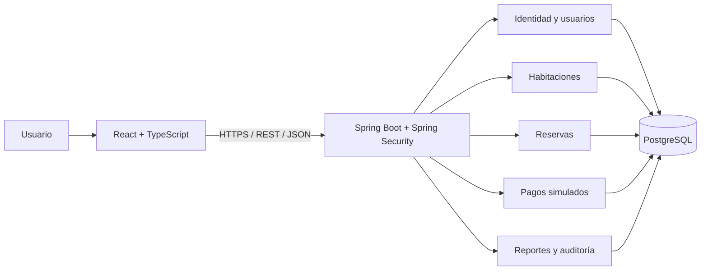

# Reservation Management System — Plan inicial

## Estado y alcance del documento

Este documento conserva íntegramente la planificación propuesta para un sistema Full Stack de reservas de hotel orientado a un portafolio profesional.

**Estado: arquitectura, reglas de negocio y Fases 0–8 aprobadas por el usuario.** La base sincronizada con GitHub es `6d93b6a`. La **Fase 9: Presentación** está autorizada para implementación y verificación local; su entrega se registra en `fase-9.md` y queda pendiente de revisión. No están autorizados staging, commit, push ni tags/releases. Se conserva la planificación original a continuación; los informes históricos registran el estado de sus respectivas entregas.

La carpeta del proyecto estaba vacía al realizar el análisis inicial. Se propone construir el sistema como un **monolito modular**, con React + TypeScript, una API REST en Spring Boot y PostgreSQL. Permitirá demostrar diseño de dominio, seguridad, transacciones, pruebas y despliegue reproducible sin añadir complejidad innecesaria.

## Stack obligatorio

- Frontend: React + TypeScript.
- Backend: Java + Spring Boot.
- API REST.
- Base de datos: PostgreSQL.
- Spring Security.
- JWT para autenticación.
- JUnit para pruebas.
- Swagger/OpenAPI para documentación.
- Docker.
- Git.

## 1. Análisis de requisitos

### Funciones solicitadas

El sistema tendrá tres roles: **CLIENTE, EMPLEADO y ADMIN**.

- Registro e inicio de sesión.
- Administración de usuarios y roles.
- Habitaciones.
- Tipos de habitación.
- Disponibilidad.
- Creación y cancelación de reservas.
- Prevención de reservas que se solapen.
- Check-in y check-out.
- Pagos simulados.
- Historial de reservas.
- Panel administrativo.
- Búsqueda, filtros y paginación.
- Auditoría de operaciones importantes.

### Límites y reglas de negocio propuestas

Para una primera versión completa se proponen estos límites y reglas:

| Aspecto | Propuesta |
|---|---|
| Hotel | Un único hotel, con zona horaria configurable. |
| Reserva | Una habitación concreta por reserva; un cliente puede tener varias reservas. |
| Fechas | Reservas por noches: entrada incluida y salida excluida. |
| Capacidad | El número de huéspedes no puede superar la capacidad del tipo de habitación. |
| Precio | Tarifa por noche, una moneda configurable y cálculo realizado en el backend. |
| Confirmación | Crear la reserva bloquea inmediatamente la habitación para esas fechas. |
| Pago | Simulado, por el importe completo; obligatorio antes del check-in. Una reserva impagada sigue bloqueando disponibilidad hasta cancelación o no presentación. |
| Cancelación | El cliente puede cancelar antes del día de entrada. El personal puede cancelar antes del check-in, indicando motivo. |
| Reembolso | Cancelar una reserva pagada genera un reembolso simulado completo. |
| Check-in | Solo personal, con reserva confirmada, pagada y dentro del periodo reservado. |
| Check-out | Solo personal y después del check-in. |
| Historial | Se conservan reservas, pagos y operaciones; se desactivan usuarios y habitaciones en lugar de borrar su historial. |

La estancia del **10 al 12 ocupa las noches del 10 y del 11**. Otra reserva puede comenzar el 12.

### Estados de reserva

- `CONFIRMED`: creada y con disponibilidad bloqueada.
- `CHECKED_IN`: huésped ingresado.
- `CHECKED_OUT`: estancia finalizada.
- `CANCELLED`: cancelada.
- `NO_SHOW`: el cliente no se presentó; lo registra el personal después del plazo de llegada.

El estado de pago será independiente. Así se podrá representar una reserva confirmada sin pagar o una cancelada con reembolso.

### Alcance posterior

Para acotar el proyecto, se dejarían para una segunda versión:

- Múltiples hoteles.
- Reservas con varias habitaciones.
- Cambios de fechas.
- Tarifas estacionales.
- Pagos reales.
- Correo transaccional.
- Recuperación de contraseña.

El check-out anticipado no liberará noches automáticamente en la primera versión.

## 2. Arquitectura propuesta

Un repositorio Git contendrá frontend, backend, infraestructura y documentación.



El backend se organizará por funcionalidad. Cada módulo tendrá controladores y DTOs, servicios de aplicación, reglas de dominio y persistencia. Los controladores no contendrán reglas de negocio, y la API no expondrá entidades JPA directamente.

| Área | Herramientas propuestas |
|---|---|
| Frontend | React, TypeScript, Vite, React Router |
| Consultas y caché | TanStack Query |
| Formularios | React Hook Form + Zod |
| Backend | Java LTS, Spring Boot, Maven Wrapper |
| Persistencia | Spring Data JPA y SQL específico donde aporte garantías |
| Migraciones | Flyway; Hibernate validará el esquema |
| Seguridad | Spring Security y JWT |
| Documentación | OpenAPI mediante springdoc y Swagger UI |
| Pruebas | JUnit, Mockito, MockMvc, Testcontainers; Vitest, Testing Library y Playwright |
| Ejecución | Docker y Docker Compose |
| Integración continua | GitHub Actions |

Antes de generar el proyecto se fijarán versiones estables compatibles, incluyendo Spring Boot, Java y springdoc, y se documentarán.

En Docker, un servidor web servirá React y reenviará `/api` al backend. Mantener el mismo origen simplificará las cookies y la configuración del navegador.

## 3. Estructura de carpetas

Esta es la distribución prevista. El árbol representa el diseño; guardar este documento no implica crear los demás archivos o carpetas.

```text
reservation-management-system/
├── README.md
├── .env.example
├── .gitignore
├── compose.yaml
├── .github/
│   └── workflows/
├── docs/
│   ├── requirements.md
│   ├── architecture.md
│   ├── data-model.md
│   ├── api-contract.md
│   ├── testing.md
│   └── adr/
├── backend/
│   ├── pom.xml
│   ├── mvnw / mvnw.cmd
│   ├── Dockerfile
│   └── src/
│       ├── main/
│       │   ├── java/com/portfolio/reservation/
│       │   │   ├── identity/
│       │   │   ├── users/
│       │   │   ├── rooms/
│       │   │   ├── reservations/
│       │   │   ├── payments/
│       │   │   ├── reporting/
│       │   │   ├── audit/
│       │   │   └── shared/
│       │   └── resources/
│       │       ├── application.yml
│       │       └── db/migration/
│       └── test/
│           ├── java/com/portfolio/reservation/
│           └── resources/
├── frontend/
│   ├── package.json
│   ├── Dockerfile
│   ├── src/
│   │   ├── app/
│   │   ├── features/
│   │   │   ├── auth/
│   │   │   ├── rooms/
│   │   │   ├── reservations/
│   │   │   ├── reception/
│   │   │   └── administration/
│   │   └── shared/
│   │       ├── api/
│   │       ├── components/
│   │       └── lib/
│   └── e2e/
└── infrastructure/
    └── nginx/
```

Dentro de cada módulo backend se usarán `api`, `application`, `domain` e `infrastructure` según sea necesario. Se evitará crear interfaces y abstracciones que no resuelvan una necesidad concreta.

## 4. Entidades y relaciones de PostgreSQL

Se proponen identificadores UUID, fechas de estancia con `DATE`, eventos con `TIMESTAMPTZ` e importes con `NUMERIC(12,2)` y `BigDecimal` en Java.

| Entidad | Campos principales y restricciones |
|---|---|
| `roles` | `id`, `name` único: CLIENTE, EMPLEADO o ADMIN. |
| `users` | `id`, `role_id`, nombre, email normalizado único, contraseña cifrada mediante hash, activo, versión de seguridad, fechas y versión de concurrencia. |
| `room_types` | `id`, nombre único, descripción, capacidad positiva, tarifa base positiva, activo. |
| `rooms` | `id`, `room_type_id`, número único, piso, estado operativo y versión. |
| `reservations` | `id`, código único, `customer_id`, `created_by`, `room_id`, entrada, salida, huéspedes, estado, tarifa acordada, total, moneda, marcas de check-in/out, motivo de cancelación y versión. |
| `payments` | `id`, `reservation_id`, importe, moneda, resultado, referencia simulada única, actor y fecha. Cada fila representa un intento. |
| `refunds` | `id`, `payment_id` único, importe, motivo, actor y fecha. Un reembolso completo por pago en esta versión. |
| `refresh_sessions` | `id`, `user_id`, hash del token, familia de rotación, vencimiento y revocación. |
| `idempotency_requests` | Usuario, operación, clave, hash de petición, referencia al resultado y vencimiento; combinación única de usuario, operación y clave. |
| `audit_events` | Actor opcional, acción, recurso, identificador, cambios permitidos en JSONB, fecha e identificador de petición. |

### Relaciones principales

- Un rol tiene muchos usuarios. Se propone **un rol por usuario** inicialmente.
- Un tipo tiene muchas habitaciones.
- Un cliente tiene muchas reservas; cada reserva corresponde a una habitación.
- `created_by` permite distinguir al cliente del empleado que registró la reserva.
- Una reserva tiene varios intentos de pago y como máximo un pago aprobado.
- Un pago aprobado puede tener un reembolso.
- Un usuario puede tener varias sesiones.

### Reglas adicionales

- Entrada estrictamente anterior a salida.
- Huéspedes e importes válidos.
- Estados limitados mediante restricciones de base de datos.
- Claves foráneas que preserven registros históricos.
- Índices para reservas por cliente y fecha, estado y fecha de entrada; auditoría por fecha y actor.
- Restricción de exclusión para impedir solapamientos, descrita en la sección de concurrencia.

La tarifa y el total quedarán guardados en la reserva: cambiar el precio del tipo de habitación no alterará reservas existentes.

La **disponibilidad se calculará** usando habitaciones operativas y reservas. No se guardará un booleano `available` que pueda quedar desactualizado. Desactivar un tipo impedirá nuevas reservas de sus habitaciones.

## 5. Endpoints REST

Todas las rutas de negocio tendrán el prefijo `/api/v1`.

En la tabla, “propia” exige comprobar que la reserva pertenece al usuario autenticado.

| Método y ruta | Propósito | Acceso |
|---|---|---|
| `POST /auth/register` | Registrar cliente | Público |
| `POST /auth/login` | Iniciar sesión | Público |
| `GET /auth/csrf` | Obtener protección CSRF para operaciones con cookies | Público |
| `POST /auth/refresh` | Renovar sesión | Sesión de renovación válida |
| `POST /auth/logout` | Revocar sesión actual | Sesión válida |
| `GET /users/me` | Consultar perfil | Autenticado |
| `PATCH /users/me` | Editar campos permitidos del perfil | Autenticado |
| `PUT /users/me/password` | Cambiar contraseña | Autenticado |
| `GET /users` | Buscar y paginar usuarios | ADMIN |
| `GET /users/{id}` | Consultar usuario | ADMIN |
| `POST /users` | Crear usuario con rol autorizado | ADMIN |
| `PATCH /users/{id}/role` | Cambiar rol | ADMIN |
| `PATCH /users/{id}/status` | Activar o desactivar usuario | ADMIN |
| `GET /room-types` y `GET /room-types/{id}` | Consultar tipos activos | Público |
| `POST /room-types` | Crear tipo | ADMIN |
| `PATCH /room-types/{id}` | Editar o desactivar tipo | ADMIN |
| `GET /rooms` y `GET /rooms/{id}` | Consultar habitaciones del catálogo | Público |
| `GET /rooms/availability` | Buscar por fechas, huéspedes, tipo y precio | Público |
| `POST /rooms` | Crear habitación | ADMIN |
| `PATCH /rooms/{id}` | Editar datos de habitación | ADMIN |
| `PATCH /rooms/{id}/status` | Cambiar estado operativo | EMPLEADO, ADMIN |
| `POST /reservations` | Crear reserva propia | CLIENTE |
| `POST /staff/reservations` | Crear para un cliente existente | EMPLEADO, ADMIN |
| `GET /reservations` | Buscar historial propio o todas las reservas | Según rol |
| `GET /reservations/{id}` | Consultar detalle | Propia, EMPLEADO, ADMIN |
| `POST /reservations/{id}/cancel` | Cancelar con motivo | Propia, EMPLEADO, ADMIN |
| `POST /reservations/{id}/check-in` | Registrar ingreso | EMPLEADO, ADMIN |
| `POST /reservations/{id}/check-out` | Registrar salida | EMPLEADO, ADMIN |
| `POST /reservations/{id}/no-show` | Registrar no presentación | EMPLEADO, ADMIN |
| `POST /reservations/{id}/payments` | Ejecutar pago simulado | Propia, EMPLEADO, ADMIN |
| `GET /reservations/{id}/payments` | Consultar pagos y reembolsos | Propia, EMPLEADO, ADMIN |
| `GET /staff/customers` | Buscar clientes con datos mínimos | EMPLEADO, ADMIN |
| `GET /admin/dashboard` | Consultar métricas por periodo | ADMIN |
| `GET /admin/audit-events` | Filtrar y paginar auditoría | ADMIN |

La cancelación gestionará automáticamente el reembolso simulado; inicialmente no hará falta un endpoint de reembolso independiente.

### Convenciones del contrato

- Paginación con `page`, `size` y `sort`, límite máximo y orden estable.
- Filtros específicos por recurso, aplicados en el servidor.
- `201` para creación; `400` para entradas inválidas; `401` sin autenticación; `403` sin permiso; `404` para recursos inexistentes o ajenos; `409` para conflictos.
- Errores con formato Problem Details, código de negocio, errores de campos e identificador de petición.
- `Idempotency-Key` obligatorio para crear reservas y ejecutar pagos.
- Documentación de campos, ejemplos, errores y permisos en OpenAPI.
- Swagger UI y `/v3/api-docs` disponibles en desarrollo; acceso controlado en despliegue.

## 6. Autenticación y permisos

El registro público asignará siempre CLIENTE. El backend ignorará o rechazará cualquier intento de registrar privilegios superiores.

Se usarán contraseñas con hash adaptativo, por ejemplo BCrypt mediante `PasswordEncoder`. Los JWT de acceso tendrán duración corta —propuesta: 15 minutos— y validación de firma, algoritmo permitido, emisor, audiencia y vencimiento mediante el soporte de Spring Security. Referencia: [documentación oficial de JWT](https://docs.spring.io/spring-security/reference/servlet/oauth2/resource-server/jwt.html).

El frontend mantendrá el token de acceso en memoria. La renovación utilizará un token aleatorio en cookie `HttpOnly`, `Secure` en HTTPS y `SameSite`, almacenando únicamente su hash en PostgreSQL. Habrá rotación y detección de reutilización.

Las operaciones autenticadas mediante cookies tendrán protección CSRF y validación de origen; no se desactivará CSRF globalmente por usar JWT. Referencia: [documentación oficial de CSRF](https://docs.spring.io/spring-security/reference/servlet/exploits/csrf.html).

Los permisos se comprobarán tanto por rol como por propiedad del recurso. Ocultar botones en React solo mejorará la interfaz; la autorización efectiva estará en el backend.

Para que una desactivación o cambio de rol tenga efecto inmediato, cada petición autenticada comprobará el estado y la versión de seguridad del usuario. Al cerrar sesión también se comprobará la revocación de la sesión asociada. Es una decisión deliberada: se mantendrá JWT, pero no una autenticación completamente independiente de la base de datos.

Además:

- El cliente no podrá enviar su propio precio, estado de reserva o resultado de pago.
- El simulador decidirá resultados mediante escenarios de prueba definidos.
- Se limitarán intentos de login y registro.
- Se impedirá desactivar o degradar al último administrador activo.
- Las claves y credenciales estarán fuera de Git; no habrá contraseñas administrativas predeterminadas en producción.

## 7. Concurrencia y reservas duplicadas

La comprobación “consultar disponibilidad y después insertar” no es suficiente: dos peticiones podrían encontrar libre la misma habitación.

La garantía principal será una **restricción de exclusión GiST en PostgreSQL**, combinando habitación y rango de fechas mediante `btree_gist`. PostgreSQL documenta expresamente este mecanismo para reservas que no deben solaparse. Referencia: [rangos y restricciones de exclusión](https://www.postgresql.org/docs/current/rangetypes.html).

La restricción incluirá reservas `CONFIRMED`, `CHECKED_IN` y `CHECKED_OUT`, conservando también la integridad histórica. Las canceladas y las no presentadas dejarán de bloquear.

### Flujo transaccional de creación

1. Validar usuario, fechas y capacidad.
2. Bloquear la habitación y comprobar su estado operativo.
3. Calcular el precio e intentar insertar la reserva.
4. Guardar la auditoría y el resultado de idempotencia.
5. Confirmar todo conjuntamente.

Si otra transacción gana las mismas fechas, se devolverá `409 ROOM_NOT_AVAILABLE`. El frontend actualizará los resultados. La búsqueda de disponibilidad no representa un bloqueo temporal.

### Otros riesgos y tratamiento

| Riesgo adicional | Tratamiento |
|---|---|
| Doble clic o reintento de red | Clave de idempotencia única; la misma petición devuelve el resultado anterior. Misma clave con otro contenido devuelve conflicto. |
| Dos pagos simultáneos | Bloqueo de la reserva y restricción de un único pago aprobado. |
| Cancelación mientras se paga | Ambas operaciones bloquean la misma reserva y vuelven a validar su estado. |
| Check-in y cancelación simultáneos | Transiciones atómicas; solo una operación compatible puede completarse. |
| Dos empleados editando | Versión de concurrencia y rechazo de actualizaciones obsoletas. |
| Habitación puesta en mantenimiento mientras se reserva | Mismo protocolo de bloqueo; se rechazará el cambio si hay reservas activas afectadas. |
| Dos administradores degradando al último ADMIN | Serializar la comprobación y el cambio de roles administrativos. |

Se mantendrá un orden de bloqueo consistente y transacciones cortas. Un bloqueo en memoria de Java no protegería frente a varias instancias del backend.

## 8. Estrategia de testing

Se priorizarán reglas de negocio y garantías que puedan fallar de formas costosas.

| Nivel | Qué se verificará |
|---|---|
| Unitarias con JUnit | Cálculo de noches y precios, cancelaciones, capacidad, transiciones y reglas de pago. |
| API con MockMvc | Validación, respuestas, autenticación, permisos y acceso a reservas ajenas. |
| Integración con PostgreSQL | Migraciones, restricciones, consultas, rollback, idempotencia y auditoría. |
| Concurrencia | Transacciones simultáneas con conexiones independientes y coordinación explícita. |
| Frontend | Formularios, errores de API, filtros, paginación y vistas según rol. |
| E2E con Playwright | Registro → login → búsqueda → reserva → pago → check-in → check-out; además cancelación y administración. |

Se usará PostgreSQL real mediante Testcontainers para las pruebas de persistencia, porque las restricciones de rangos son parte esencial del diseño. Referencia: [módulo oficial de PostgreSQL](https://java.testcontainers.org/modules/databases/postgres/).

La prueba crítica lanzará dos reservas simultáneas sobre la misma habitación y fechas: **exactamente una debe confirmarse**. También se comprobará que fechas contiguas y habitaciones diferentes sí se aceptan.

Otras pruebas cubrirán tokens vencidos, sesiones revocadas, escalada de roles, doble pago, reembolso único y fallos que no deben dejar operaciones parcialmente guardadas. El reloj será inyectable para comprobar fechas sin depender del día de ejecución.

## 9. Fases pequeñas de desarrollo

Cada fase entregará comportamiento verificable y documentación actualizada. Ninguna fase se iniciará por la sola creación de este documento.

| Fase | Entregable | Criterio de finalización |
|---|---|---|
| 0. Acuerdo de diseño | Requisitos, decisiones, modelo y contrato inicial | Reglas de negocio aprobadas. |
| 1. Base ejecutable | React, Spring Boot, PostgreSQL, Compose, Flyway y CI mínima | Proyecto arrancable desde instrucciones reproducibles. |
| 2. Identidad | Registro, login, renovación, logout y roles | Flujo de sesión y pruebas de autorización completos. |
| 3. Catálogo | Tipos y habitaciones, administración y catálogo público | CRUD permitido, validación y paginación funcionales. |
| 4. Disponibilidad | Búsqueda por fechas y capacidad | Consulta correcta con pruebas de límites. |
| 5. Reservas | Creación, historial, cancelación e idempotencia | Prueba concurrente que impide solapamientos. |
| 6. Pagos simulados | Intentos de pago y reembolso por cancelación | Sin doble cobro ni reembolso duplicado. |
| 7. Recepción | Check-in, check-out y no presentación | Transiciones y permisos probados de extremo a extremo. |
| 8. Administración | Usuarios, roles, métricas y consulta de auditoría | Flujos administrativos completos. |
| 9. Presentación | E2E, Docker final, datos de demostración y documentación | Otra persona puede ejecutar y evaluar el proyecto. |

La auditoría se incorporará desde las primeras operaciones importantes; la fase 8 añadirá su interfaz de consulta.

## 10. Plan de implementación y calidad

Después de aprobar el diseño, se comenzará por documentarlo y preparar una base mínima ejecutable. Cada funcionalidad seguirá este orden:

1. Contrato y criterios de aceptación.
2. Migración si corresponde.
3. Reglas de negocio.
4. API y permisos.
5. Interfaz.
6. Pruebas relevantes.
7. Actualización de documentación.

Git tendrá cambios pequeños y coherentes. La integración continua ejecutará compilación, análisis estático y pruebas; las pruebas E2E se incorporarán cuando exista el primer recorrido completo.

### Criterios de finalización de una funcionalidad

- Cumple sus criterios de aceptación y controles de acceso.
- Maneja validaciones, errores y estados de carga en la interfaz.
- Tiene pruebas relevantes y documentación OpenAPI actualizada.
- Registra auditoría si modifica información importante.
- Funciona dentro del entorno Docker.

### Auditoría y registros de seguridad

La auditoría de operaciones exitosas se guardará en la misma transacción que el cambio e incluirá actor, acción y campos permitidos, sin contraseñas ni tokens. Los fallos de autenticación tendrán registros de seguridad separados.

### Entrega de portafolio

El portafolio incluirá:

- README con puesta en marcha.
- Diagrama de arquitectura.
- Modelo de datos.
- Decisiones técnicas justificadas.
- Cuentas de demostración exclusivas del entorno demo.
- Evidencia de la prueba de concurrencia.

El panel distinguirá ocupación, llegadas, salidas, reservas e ingresos simulados netos de reembolsos, con periodo y fórmula documentados.

## Estado de aprobación

La arquitectura, las reglas de negocio y las Fases 0–8 están aprobadas. La Fase 9 está autorizada exclusivamente para presentación y su entrega requiere revisión. Los cambios se conservan en el working tree sin staging; commit, push y tags/releases requieren autorización posterior.
